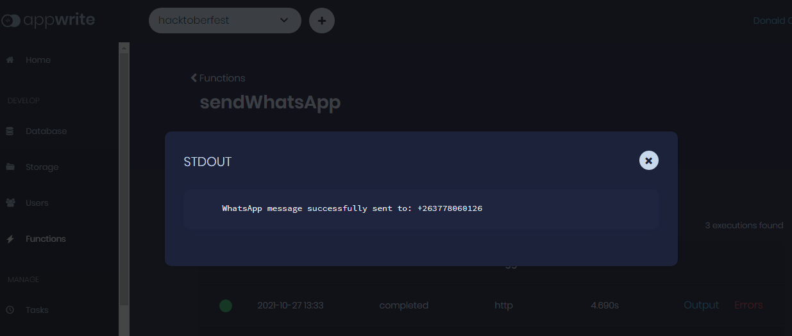
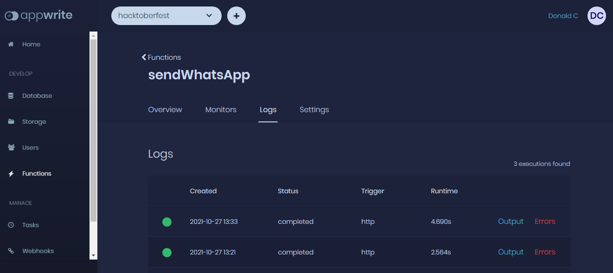

#  Send WhatsApp 
A Python Cloud Function to send a WhatsApp message to a number using Twilio API.
<br>

## 🚀 Result


<br>


## 📝 Environment Variables
Go to Settings tab of your Cloud Function. Add the following environment variables.

* **ACCOUNT_SID** -  Your Twilio account sid
* **AUTH_TOKEN** -  Your Twilio account Authorization Token
* **FROM_NUMBER** -  Your Twilio phone number to send WhatsApp from (can be your sandbox number) (in international format)


## Twilio Account
 - You can create Free Trial Account, and get $15 Credits [Free Trial Twilio](https://www.twilio.com/try-twilio)
- Setup Your Development Sandbox refer to [Setup Sandbox](https://www.twilio.com/docs/whatsapp/sandbox)
- For Production [Request to enable your Twilio numbers for WhatsApp](https://www.twilio.com/whatsapp/request-access)

## 🚀 Building and Packaging

To package this as a cloud function, follow these steps.

```bash
$ cd demos-for-functions/python/send-whatsapp-message

$ PIP_TARGET=./.appwrite pip install -r ./requirements.txt --upgrade --ignore-installed 
```

* or cd into your current directory and run
```bash
$ pip install -t ./.appwrite -r ./requirements.txt --upgrade --ignore-installed
```

* Ensure that your folder structure looks like this 
```
.
├── .appwrite/
├── main.py
└── requirements.txt
```

* Create a tarfile

```bash
$ cd ..
$ tar -zcvf code.tar.gz send-whatsapp-message
```

* Navigate to the Overview Tab of your Cloud Function > Deploy Tag
* Input the command that will run your function (in this case `python main.py`) as your entry point command
* Upload your tarfile 
* Click 'Activate'

## Trigger
You can trigger the function using the SDK, HTTP API or the Appwrite Console

Your data must include the following data and format:<br>
**NB:** `phoneNumber` must be in international format e.g `+263772000999`
```json
{
    "phoneNumber": "<receiver's phone number>",
    "text": "<message body>"
}

```
